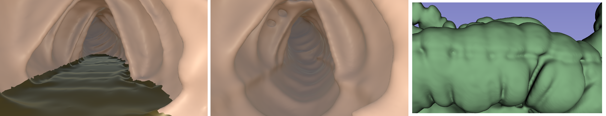

# GeometricalColonSeg
A pipeline developed for project Xavier for colon segmentation with the goal of improving VR colonography.

## Requirements
1- Git for windows must be installed.

2- Visual studio must have "Desktop development with C++" and "Windows 10 SDK" packages.

3- To install run install.bat it probably needs to be executed twice as it will stop after installing vcpkg.

4- To run the program open the project in visual studio and execute it from the IDE.

5- Additionally to run the .nii conversion scripts python and simpleITK need to be installed.

## How It Works
1. **Input**:
   - The program will prompt you to provide the file path to a `.nii` image.
   
2. **Processing**:
   - Once the file path is provided, the program processes the `.nii` image.

3. **Output**:
   - The processed output is written in the same directory as the `.py` script.
   - The output file will have the same name as the input but will start with `FinalLabel` currently it also prints other files for debug.
  

## Convert dicom to .nii
Run the included script using 
python dicom_to_nifti.py /path/to/your/dicom/folder --output your_output.nii
This needs simpleITk to be installed.

## Pipeline Overview

1. **Air Region Segmentation**:
   - Segments air-filled regions using thresholding.
   - Filters out irrelevant structures (e.g., lungs, patient bed) through heuristics and connected component analysis.

2. **Boundary Detection**:
   - Detects boundaries between air and liquid regions by applying Sobel filters to identify downward-facing flat patches.
   - Expands these patches through region growing based on Sobel filter Y-coordinate similarity, achieving robust boundary layer segmentation.

3. **Liquid Pocket Segmentation**:
   - Enhances contrast in liquid regions using filtering techniques (e.g., histogram equalization).
   - Segments liquid pockets using thresholding or region-growing algorithms.

4. **Integration and Refinement**:
   - Combines air and liquid regions into a single representation.
   - Eliminates liquid pockets and boundary regions that do not intersect.

## Key Features
- Fully automated, requiring no manual interaction.
- Works with a single CT scan to reduce radiation exposure and patient discomfort.
- Accurate segmentation of air and liquid pockets, even in challenging cases with low contrast.
